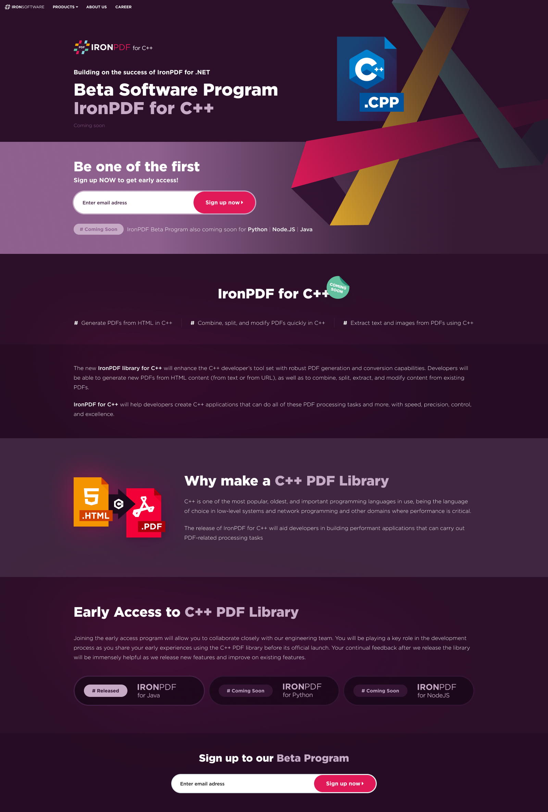
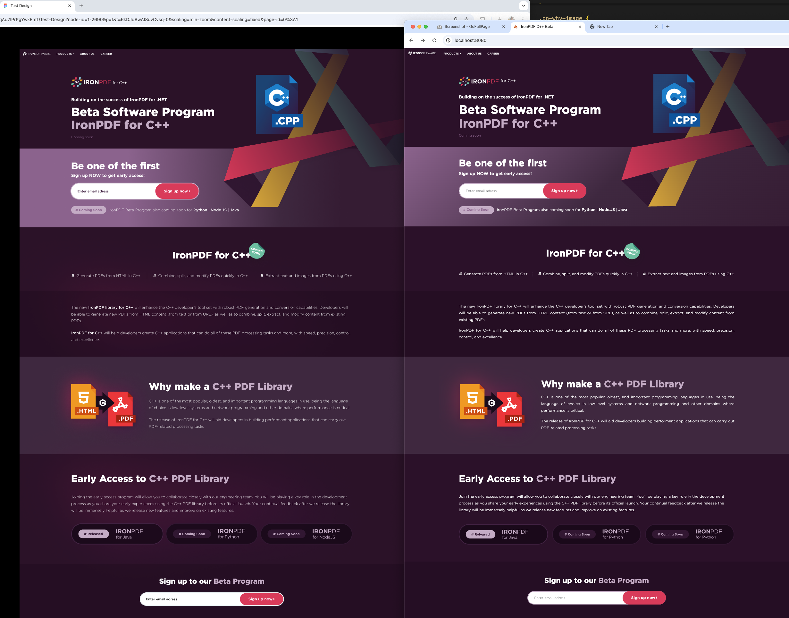
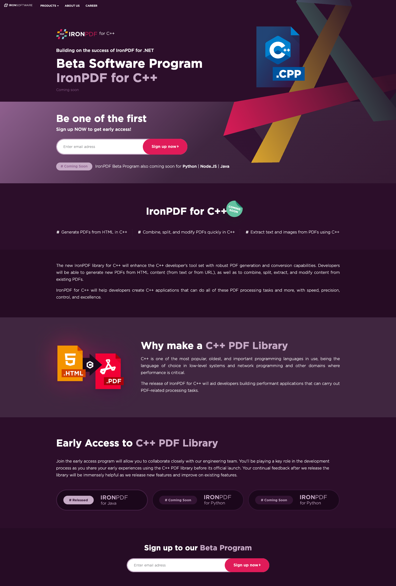
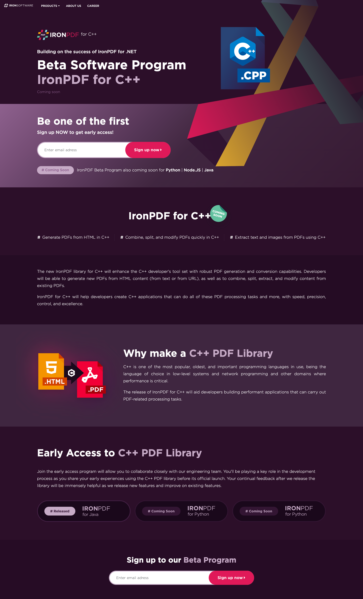
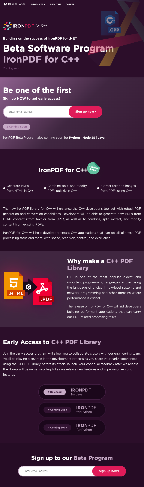

# QA Checklist (With Evidence)

Status legend: `PASS` = meets target, `PARTIAL` = works but has improvement items.

## 1) Pixel Alignment and Spacing

| Case | Result | Evidence |
|---|---|---|
| Section spacing matches design on desktop | PASS | [web-big-screen-1600.png](screenshots/web-big-screen-1600.png), [web-laptop-screen-1440.png](screenshots/web-laptop-screen-1440.png) |
| Button paddings and card spacing are consistent | PASS | [web-big-screen-1600.png](screenshots/web-big-screen-1600.png), [tablet-screen-768.png](screenshots/tablet-screen-768.png), [mobile-screen-430.png](screenshots/mobile-screen-430.png) |
| Border radius and visual rhythm are consistent | PASS | Signup pills/cards visible in [web-big-screen-1600.png](screenshots/web-big-screen-1600.png) and [mobile-screen-430.png](screenshots/mobile-screen-430.png) |
| Figma-to-web parity at large desktop | PASS | Side-by-side reference [PixcelPerfectFigmaAndWeb-1600px.png](screenshots/PixcelPerfectFigmaAndWeb-1600px.png) |

## 2) Typography Accuracy

| Case | Result | Evidence |
|---|---|---|
| Heading hierarchy is semantically correct and balanced | PASS | `h1/h2` usage in `ci4-app/app/Views/home.php`; visual verification in all screenshots |
| Body/readability styles are consistent | PASS | [web-laptop-screen-1440.png](screenshots/web-laptop-screen-1440.png), [tablet-screen-768.png](screenshots/tablet-screen-768.png) |
| Emphasis styles (highlight words, badges, CTA) match visual hierarchy | PASS | [FigmaExport.png](screenshots/FigmaExport.png), [web-big-screen-1600.png](screenshots/web-big-screen-1600.png) |

## 3) Responsive Behaviour

| Case | Result | Evidence |
|---|---|---|
| Desktop layout at `1600` remains intact | PASS | [web-big-screen-1600.png](screenshots/web-big-screen-1600.png) |
| Laptop layout at `1440` remains intact | PASS | [web-laptop-screen-1440.png](screenshots/web-laptop-screen-1440.png) |
| Tablet layout at `768` stacks/flows correctly | PASS | [tablet-screen-768.png](screenshots/tablet-screen-768.png) |
| Mobile layout at `430` stacks correctly and keeps CTA usable | PASS | [mobile-screen-430.png](screenshots/mobile-screen-430.png) |
| No horizontal overflow/regression in captured views | PASS | No clipped right-edge artifacts across provided screenshots |

## 4) Cross-Browser Behaviour

| Case | Result | Evidence |
|---|---|---|
| Bootstrap-based components and CSS features are standards-compliant | PASS | Bootstrap 5 import in `ci4-app/app/Views/home.php`; no browser-specific CSS hacks in `ci4-app/public/assets/css/styles.css` |
| Navigation dropdown semantics are compatible with modern browsers | PASS | `data-bs-toggle="dropdown"` and `aria-expanded` in `ci4-app/app/Views/home.php` |

## 5) SEO Validation

| Case | Result | Evidence |
|---|---|---|
| `title` tag is present and dynamic | PASS | `ci4-app/app/Views/home.php` (`<title><?= esc($page['meta']['title'] ...`) |
| Meta description is present and dynamic | PASS | `ci4-app/app/Views/home.php` (`<meta name="description" ...`) |
| Semantic sections are used (`header`, `section`, `footer`) | PASS | `ci4-app/app/Views/home.php` structure |
| Link texts are meaningful | PASS | Header navigation labels in `ci4-app/app/Data/homepage.json` rendered in view |
| Lighthouse SEO score (Web) | PASS | [lighthouse-web.pdf](screenshots/lighthouse-web.pdf) = `100` |
| Lighthouse SEO score (Mobile) | PASS | [lighthouse-mobile.pdf](screenshots/lighthouse-mobile.pdf) = `100` |

## 6) Accessibility Basics

| Case | Result | Evidence |
|---|---|---|
| Images include alt text | PASS | JSON alt fields in `ci4-app/app/Data/homepage.json`; rendered in `ci4-app/app/Views/home.php` |
| Form input has accessible label text via `aria-label` | PASS | Signup inputs in `ci4-app/app/Views/home.php` |
| Dropdown state attribute exists (`aria-expanded`) | PASS | Navbar dropdown trigger in `ci4-app/app/Views/home.php` |
| Viewport meta exists for mobile accessibility | PASS | `<meta name="viewport"...>` in `ci4-app/app/Views/home.php` |

## 7) Core Web Vitals Considerations

| Case | Result | Evidence |
|---|---|---|
| Layout stability from static section structure | PASS | Stable section blocks in `ci4-app/app/Views/home.php`; consistent captured render across breakpoints |
| Lightweight assets and SVG usage for key visuals | PASS | SVG assets under `ci4-app/public/assets/images/` and matching screenshots |
| No JS-heavy runtime rendering path for initial UI | PASS | Server-rendered PHP view + JSON data (`Home` controller + `home.php`) |

## 8) Lighthouse Checks

| Case | Result | Evidence |
|---|---|---|
| Web Lighthouse Performance | PASS | [lighthouse-web.pdf](screenshots/lighthouse-web.pdf) = `99` |
| Web Lighthouse Accessibility | PARTIAL | [lighthouse-web.pdf](screenshots/lighthouse-web.pdf) = `89` (buttons accessible name, contrast, main landmark) |
| Web Lighthouse Best Practices | PASS | [lighthouse-web.pdf](screenshots/lighthouse-web.pdf) = `100` |
| Web Lighthouse SEO | PASS | [lighthouse-web.pdf](screenshots/lighthouse-web.pdf) = `100` |
| Mobile Lighthouse Performance | PARTIAL | [lighthouse-mobile.pdf](screenshots/lighthouse-mobile.pdf) = `82` (report notes extension/throttling impact) |
| Mobile Lighthouse Accessibility | PARTIAL | [lighthouse-mobile.pdf](screenshots/lighthouse-mobile.pdf) = `89` (same flagged items as web) |
| Mobile Lighthouse Best Practices | PASS | [lighthouse-mobile.pdf](screenshots/lighthouse-mobile.pdf) = `100` |
| Mobile Lighthouse SEO | PASS | [lighthouse-mobile.pdf](screenshots/lighthouse-mobile.pdf) = `100` |

## 9) Data Source and Rendering

| Case | Result | Evidence |
|---|---|---|
| JSON schema/content drives page sections | PASS | `ci4-app/app/Data/homepage.json` mapped across hero, signup, features, why, early access, footer |
| Fallback handling for missing/malformed JSON | PASS | `loadHomepageData()` guard clauses in `ci4-app/app/Controllers/Home.php` |
| Dynamic rendering without PHP notices in view flow | PASS | Guarded/optional checks (`??`, `! empty`) throughout `ci4-app/app/Views/home.php` |

## Screenshot Set Used

### PNG previews (clickable)

- [FigmaExport.png](screenshots/FigmaExport.png)

- [PixcelPerfectFigmaAndWeb-1600px.png](screenshots/PixcelPerfectFigmaAndWeb-1600px.png)

- [web-big-screen-1600.png](screenshots/web-big-screen-1600.png)

- [web-laptop-screen-1440.png](screenshots/web-laptop-screen-1440.png)

- [tablet-screen-768.png](screenshots/tablet-screen-768.png)

- [mobile-screen-430.png](screenshots/mobile-screen-430.png)

### PDF reports (links)

- [lighthouse-web.pdf](screenshots/lighthouse-web.pdf)
- [lighthouse-mobile.pdf](screenshots/lighthouse-mobile.pdf)
